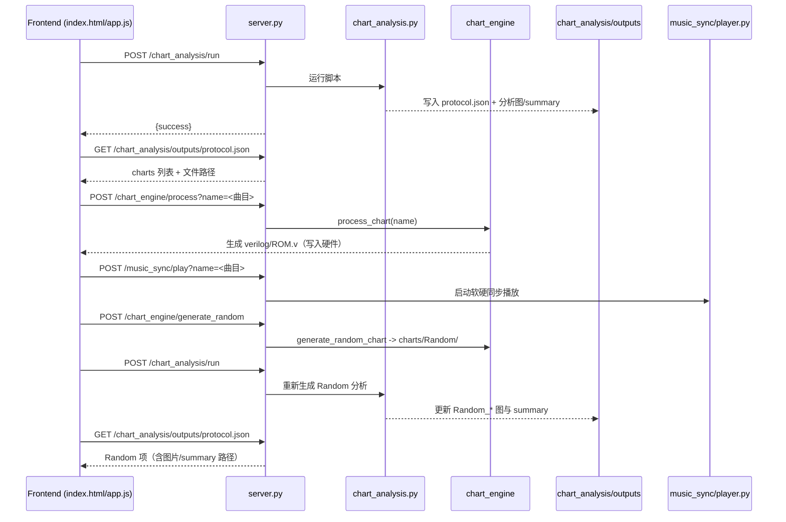

# MuseDash 前端与服务端设计实现说明

本文聚焦 `frontend/index.html`、`frontend/app.js` 与根目录 `server.py` 的交互设计、主要逻辑和数据流。

## 目录与职责
- `frontend/index.html`：单页 UI 布局与样式，包含启动遮罩、模式选择（普通/随机）、曲目列表、预览区和操作按钮。
- `frontend/app.js`：前端状态机与事件处理；负责调用后端接口、渲染分析结果、音频预览、随机谱面生成、写入 BPM/ROM 以及调用 Quartus。
- `server.py`：轻量 HTTP 服务（继承 `SimpleHTTPRequestHandler`），既提供静态文件，也暴露前端调用的 POST API（chart_analysis、chart_engine、music_sync、Quartus 打开等），并串联底层脚本。

## 前端交互流程（app.js）
- 启动：点击遮罩触发 `startExperience()`，显示模式选择；之后模式切换通过 `switchMode("normal" | "random")` 控制普通/随机面板的显隐。
- 普通模式：
  - 先 `triggerChartAnalysisRun()` 触发后端运行 `chart_analysis.py`，完成 `chart_analysis/outputs/protocol.json` 与统计图/summary JSON 的生成。
  - `fetchChartsFromBackend()` 读取 protocol，将曲目列表（过滤掉 Random）渲染为卡片；悬停调用 `renderPreviewImages`、`renderSummary`、`playPreviewAudio` 展示分析图、数据摘要和随机片段音频。
  - 选中曲目后，`applyNormalSelection()` 通过 `runChartEngine(name)` POST `/chart_engine/process`，由后端 `process_chart` 生成 BPM/ROM（写入 `verilog/ROM.v` 等）。`openQuartus()` 则 POST `/quartus/open`，必要时回退为直接下载 `quartus/MuseDash.qsf`。
  - `playMusicSync(name)` 会先 POST `/music_sync/stop`，再 POST `/music_sync/play` 以启动 `music_sync/player.py` 做软硬同步播放。
- 随机模式：
  - 首次进入或点击“重新生成”触发 `generateRandomChart()` → `runGenerateRandom()` POST `/chart_engine/generate_random` 生成 `charts/Random/` 下的新谱。
  - 紧接着再次调用 `chart_analysis/run`，再用 `loadRandomPreview()` 读取 protocol 中 Random 的条目，刷新分析图、summary 与 meta 信息（BPM/时长/物量），并用 `RANDOM_COVER` 占位封面。
  - 写入/打开 Quartus 与普通模式一致，调用的是同一批接口，只是曲目名固定为 Random。
- 公共逻辑：
  - `detectBasePath()` 兼容本地 file:// 打开与本地服务器，自动推导根路径。
  - 通过 `renderTrackList`、`renderPreviewImages`、`renderSummary`、`formatSummary`、`formatDurationForDisplay` 等辅助函数组织 UI 和文案；`normalizeAudioPath`/`ensureChartsFolder` 规范化协议中给出的路径。
  - `previewAudio` + `fadeIn`/`fadeOutAndRestart`/`restartRandomSegment` 实现悬停试听的淡入淡出与随机片段循环。

## 页面结构（index.html）
- 背景：全屏渐变+纹理叠加（`.bg` + `.scrim`）。
- 启动层：`.start-overlay` 遮罩提示点击开始。
- 模式选择：两个 `.big-btn`（普通/随机）。
- 模式工具条：`.mode-bar` 上的切换按钮。
- 普通模式面板：状态文案 `#normalStatus`，横向滚动的曲目卡片 `#trackList`，预览区域（meta/分析图/summary 文本），操作按钮区（写入 BPM&ROM、打开 Quartus、启动软硬同步）。
- 随机模式面板：状态文案 `#randomStatus`，Random 卡片（封面/统计），分析图与 summary 预览，操作按钮（生成/写入/Quartus/软硬同步）。
- 样式：柔和玻璃态面板、渐变主色（粉/蓝）和状态色，保证桌面和移动端都可滚动/点击。

## 后端接口与实现（server.py）
- 基础：`ThreadingHTTPServer` 提供静态目录，同时拦截 POST 路径；命令行参数 `--host/--port`（默认 127.0.0.1:8000）。
- `/chart_analysis/run`：加锁防重入，调用 `chart_analysis/chart_analysis.py`，输出 `chart_analysis/outputs/` 下的 protocol.json、PNG、summary JSON。
- `/chart_engine/process?name=...&output=ROM.v`：调用 `chart_engine.process_chart`，生成 Verilog（写入 `verilog/<output>`）。
- `/chart_engine/generate_random`：调用 `chart_engine.generate_random_chart`，将随机谱写入 `charts/Random/`（返回 seed、路径）。
- `/quartus/open`：通过 `_open_with_system` 使用操作系统默认方式打开 `quartus/MuseDash.qsf`。
- `/music_sync/play?name=...` 与 `/music_sync/stop`：串联 `music_sync/player.py`，用锁避免多实例；前者会先尝试 stop 再启动。
- 错误处理：接口统一 JSON 响应（`success`/`message`），失败时返回 4xx/5xx；stdout/stderr 也被收集便于前端提示。

## 前后端通信流程

## 数据与文件流
- 输入：`charts/<曲目>/` 目录（音频/封面/谱面数据），随机模式生成 `charts/Random/`。
- 分析输出：`chart_analysis/outputs/` 下的 `protocol.json`、各曲目的 PNG 分析图、`*_summary.json`。
- 硬件输出：`chart_engine/process_chart` 生成 `verilog/ROM.v`（或自定义 `output` 参数）。
- 前端引用：app.js 基于 protocol 组装封面、分析图、summary、音频路径；悬停播放使用 `<audio>`。

## 启动与调试提示
- 启动开发服：`python server.py --host 127.0.0.1 --port 8000`，浏览器打开 `http://127.0.0.1:8000/frontend/`。
- 调试数据：若 protocol 拉取失败，前端会使用 `MOCK_CHARTS` 占位，但写入/音乐同步等仍需后端可用。
- 生成/写入慢时，前端状态栏会提示当前步骤（chart_analysis、chart_engine、music_sync），必要时查看后端终端输出。
